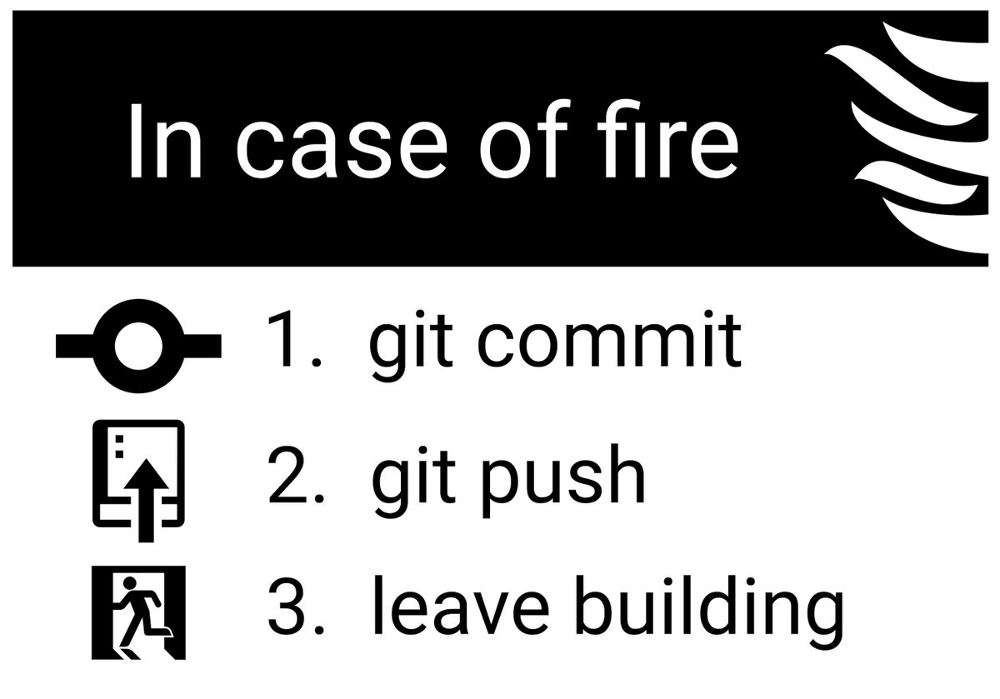

# Инструкция по работе с Git

## 1. Проверка наличия установленного Git

Чтобы проверить наличие установленного Git необходимо ввести в терминале команду `git version`.

Если Git установлен, то появляется сообщение с информацией о версии программы.

Иначе будет выведено сообщение об ошибке.

## 2. Установка Git

Загружаем последнюю версию Git с [сайта](https://git-scm.com/downloads).

## 3. Настройка при первом использовании Git

При первом использовании Git необходимо представиться. Для этого в терминале нужно ввести две команды:
```
git config --global user.name <Ваше имя>
git config --global user.email <адрес Вашей электронной почты>
```

## 4. Добавление папки в репозиторий

Для того, чтобы добавить папку в репозиторий, необходимо, находясь в этой папке, ввести команду `git init`.

## 5. Добавление файлов для контроля версий и фиксация текущих изменений

### *5.1. Сохранение и проверка статуса теекущего состояния документа*

Перед добавлением файлов для контроля необходимо сохранять изменения с помощью комбинации клавиш _**Ctrl + S**_.

Для проверки статуса файлов, добавлен ли файл для контроля версий и зафиксированы ли текущие изменения, используется команда `git status`.

После внесения изменения и сохранения, если файл ещё ни разу не добавлялся для отслеживания, то после введение команды в терминале появится сообщение:
>Untracked files: [имя файла]

то есть сообщение о неотслеживаемых файлах.

В противном случае в терминале появится сообщение:
>Change not staged for commit: modified: [имя файла]

то есть изменение не подготовлено для фиксации: изменённый: [имя файля]. Причем слово *modified* выделено красным цветом.

### *5.3. Добавление к отслеживанию и фиксация изменений*

Для добавления файла к отслеживанию используется команда `git add имя файла`. После этого выполнение команды `git status` терминал сообщает:
>Change to be commited: modified: [имя файла]

то есть изменения должны быть зафиксированы: изменённый: [имя файла]. Причём слово *modified* выделено зелёным, так как файл с его изменениями добавлен к отслеживанию.

Для фиксации изменений, после команды `git add` необходимо использовать команду `git commit - m "любое сообщение, описывающее характер изменений"`. 

Существует сокращённый вариант для команд `git add` и `git commit -m` - это `git commit -a -m` или `git commit -am`. **Но NB!**
+ эта команда не добавляет файл к отслеживанию. Для этого годится только команда `git add`, которая имеет две функции: 1) добавление файла к отслеживанию изменений 2) добавление изменений в индекс (stage), присваивание им хеш-кода и подготовка их фиксации.
+ так как в сокращенной форме не указывается имя файла, то при фиксации с помощью `git commit -am` закоммитятся изменения во всех изменненных файлах репозитория.

Если использовать команду `git commit` без флага -m (message), то откроется тектовый редактор, в котором необходимо ввести комментарий, описывающий изменения. Чтобы выйти из редактора, необходимо нажать Esc и в активной строке ввести:
>:wq

После нажатия Enter произойдёт возвращение в терминал.

После фиксации изменений при вызове команды `git status` в терминале появится сообщение:
>Nothing to commit, working tree clean

то есть нечего коммитить, рабочее дерево чистое.

Для изменения комментария последнего коммита можно использовать команду `git commit --amend -m "Новое сообщение"`.

Также можно посмотреть разницу между текущим состоянием документа и последним закоммиченным. Для этого используется команда `git diff`.

## 6. Вызов журнала изменений и работа с ним

Для вызова журнала изменений необходимо использовать команду `git log`. В терминале появится список всех коммитов с сообщениями, которые кратко описывают характер изменений. У каждого коммита есть т. н. хеш-код, 40-значный код, состоящий из цифр и букв.

Для вызова короткого варианта журнала изменений используется команда `git log --oneline`. В этом варианте отображены только первые 7 символов хеш-кодов коммитов.

Для вызова списка из последних n коммитов применяется комманда `git log -n`, где n - число последних интересующих коммитов.

Также существуют команда для вызова списка изменений в графическом представлении веток, о которых речь пойдёт позже: `git log --graph`. И аналогично `git log --oneline` можно вызвать короткий вариант - `git log --graph --oneline`.

Чтобы выйти из режима журнала необходимо нажать кнопу 'Q' (от англ. quit - уходить, выйти).

Для вызова конкретного коммита необходимо использовать команду `git checkout ****`, где звёздочки обозначают четыре первых символа хеш-кода.

После вызова предыдущих коммитов нужно не забывать возвращаться в актуального состояние, чтобы не потерять информацию. Для этого используется команда `git checkout master`, то есть возращение в текущее состояние в ветке __*master*__.

## 7. Переименование файла

После переименования файла Git считает этот файл со старым названием удалённым, а у файла с новым названиям все изменения не сохранены. Поэтому обязательно необходимо после переименования закоммитить все изменения.

## 8. Игнорирование файла
Чтобы Git игнорировал какой-либо файл необходимо:

1. Создать файл с названием .gitignore
2. C помощью `git add` добавить .gitignore к отслеживанию
2. Добавить в .gitignore информацию о файлах, которые следует игнорировать. Также можно добавлять типы файлов, например *.jpg.
2. Сохранить изменения в .gitignore, добавить изменения в индекс и закомитить.



## 9. Полезные советы

Для перемещения между папками можно использовать следующие команды:
* `cd ..` - перемещение на один уровень выше.
* `cd <название папки>` - открыть папку, находящуюся на уровне, где вы находитесь.

Для очистки терминал используется команда `clear`.

Для быстрого ввода названия папки или файла, набрав достаточное количество символов для однозначной идентификации, можно воспользоваться кнопкой Tab. Название автоматически дозаполнится.

Для вызова команды, которая уже использовалась в терминале можно воспользоваться клавишей курсора вверх.

Любой комманде можно задать более короткий и удобный псевдоним. Для этого используется команда: `git config --global alias.<псевдоним> '<исходная команда>'`. Чтобы просмотреть список уже созданных псевдонимов необходимо использовать команду `git config --global --list`.

## 10. Cоздание веток в Git

Ветка в Git - это простой перемещаемый указатель на один из коммитов, обычно последний в цепочке коммитов.

Для создания новой ветки необходимо вызвать команду `git branch <название новой ветки>`. Если программа не выдаёт ошибки, значит ветка создана.

Чтобы перейти из одной ветки в другую, необходимо выполнить команду, аналогичную переходу к какому-либо коммиту, `git checkout <название ветки>`.

Также можно объединить две предыдущие команды, чтобы при создании ветки сразу же в неё попадать. Для этого используется команда `git checkout -b <название новой ветки>`.

Для просмотра всех существующих веток и наше расположение среди них используется команда `git branch`. В терминале появится список веток в алфавитном порядке, а перед веткой в которой мы находимя будет стоять звёздочка (*).

## 11. Слияние веток и разрешение конфликтов

Для слияния веток используется команда `git merge <название ветки>`. Причём необходимо учитывать:
+ ветка, указанная в команде является донором внесённых изменений;
+ ветка, в которой мы находимся, и из которой выполняем команду слияния, соотвественно - акцептором.

Если была изменена одна и та же часть файла в обеих ветках, то может возникнуть конфликт, который потребует участия пользователя. Пользователю будет предложено оставить закоммиченные изменения ветки, в которую вливаюся измения, или заменить их на входящие изменения, либо оставить оба варианта. Также можно сравнить изменения, чтобы сделать в дальнейшем выбор.

После разрешения конфликта необходимо произвести сохранение и сделать коммит слияния.

Для отмены слияния можно использовать команду `git merge --abort`. Данная команда может быть использована только до того, как слияние закоммичено.

## 12. Удаление веток 

Для удаления какой-либо ветки используется команда `git branch -d <название ветки>`. В случае, если в удаляемой ветке имеются изменения, которые отсутствуют в других ветках, в частности в master, в терминале об этом будет указано и предложено использовать команду `git branch -D <название ветки>`, которая принудительно удалит ветку вне зависимости от наличия в ней не слившихся изменений.

Также нужно иметь в виду, что невозможно удалить ветку, находясь в ней же.

## 13. Работа с удалёнными репозиториями

Для работы с удалёнными репозиториями необходимо создать аккаунт на [GitHub](https://github.com/). Также у Вас должен быть локальный репозиторий.

### *13.1 Связка удалённого репозитория с локальным*

Предварительно необходимо скопировать адрес удалённого репозитория. Это можно сделать двумя путями:
+ нажать внутри удаленного репозитория на GitHub кнопку "Code", и в открывшемся меню скопировать ссылку
+ Скопировать в адресной строке браузера адрес и к нему добавить ".git".

Чтобы связать удалённый и локальный репозиторий используется команда `git remote add origin <адрес удаленного репозитория>`. Нужно понимать, что `origin` - это псевдоним удалённого репозитория, который мы его даём при вводе команды. Вместо `origin` можно использовать любое другое слово, но всё же принято использовать именно такой псевдоним.

Команда `git remote` выведет в терминале связанные репозитории. Эта же команда с флагом `-v` покажет тот же результат, но ссылками.

### *13.2 Клонирование удалённых репозиториев

Для получения локальной копии удалённого репозитория используется команда `git clone <адрес удалённого репозитория>`. Такая операция особенно удобна, если у Вас ещё нет интересуещего проекта в локальном репозитории.

После выполнения команды в локальном репозитории появится новая папка с именем, идентичным названию удаленного репозитория. Для дальнейшей работы с ним необходимо зайти в эту папку.

### *13.3 Извлечение данных из удалённых репозиториев*

Для извлечения данных из удалённых репозиториев и их слияния с текущим  локальным репозиторием используется команда `git pull origin main`. При первом слиянии программа может выдать ошибку, произошедшую с несвязанными историями. Эту проблему можно обойти принудительно "стянув" данные с помощью дополнительных параметров:
```
git pull --allow-unrelated-histories origin main
```
### *13.4 Отправка данных в удаленный репозиторий*

Для отправки данных в удалённый репозиторий необходимо использовать команду `git push origin main`, или в общей форме `git push <адрес удалённого репозитория> <имя ветки>`.

### *13.5 Работа на GitHub*

Имея связанный локальный репозиторий, мы можем изменять данные на удалённом репозитории, и с помощью команды `git pull` стягивать эти изменения в локальный репозиторий.

Для работы с не своим репозиторием необходимо сперва "форкнуть" его (*англ. fork - вилка*) с аккаунта владельца. После чего можно с ним работать на GitHub или в Git. После внесения изменений в такой репозиторий можно отправить запрос на вытягивание изменений в исходный репозиторий. Для этого необходимо на GitHub нажать "Pull Request", добавить при желании описание изменений и подтвердить свои намерения нажатием "Create pull request".

